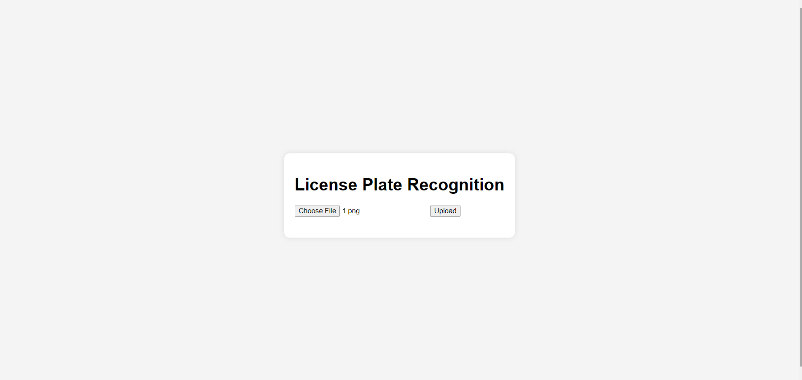

# License Plate Recognition System

This project is a License Plate Recognition System that detects and recognizes license plates from images. It includes a backend powered by OpenCV and Python for image processing and character recognition, and a frontend built with HTML, CSS, and JavaScript for user interaction.

## Features

- Detects and recognizes license plates from uploaded images
- Highlights detected license plates on images
- Sends email notifications with the detected license plate number
- Simple and user-friendly web interface

## Technology Stack

- **Backend**: Python, Flask, OpenCV
- **Frontend**: HTML,CSS,JAVASCRIPT
- **Email Notifications**: SMTP

## Installation

### Prerequisites

- Python 3.x
- pip (Python package installer)
- OpenCV
- Flask

### Setup

1. **Clone the repository:**

   ```bash
   git clone https://github.com/your-username/license-plate-recognition.git
   cd license-plate-recognition


Install required Python packages:

bash

pip install -r requirements.txt

Create requirements.txt with the following content:

text

Flask
opencv-python
numpy

Download and setup the required files:

    Ensure you have the necessary OpenCV training files (like haarcascade_russian_plate_number.xml).
    Place your email credentials in the send_email function in app.py.

Run the Flask server:

    python app.py

Open your web browser and go to:

    http://127.0.0.1:5000

Usage

    Upload an image containing a vehicle's license plate.
    The system will process the image, detect the license plate, and display the result.
    An email notification will be sent with the detected license plate number.

Project Structure

php

.
├── app.py                     # Main backend file with Flask server
├── DetectChars.py             # Character detection module
├── DetectPlates.py            # Plate detection module
├── PossiblePlate.py           # Possible plate module
├── templates/
│   └── index.html             # Frontend HTML file
├── static/
│   └── imgOriginalScene.png   # Output image after processing
├── requirements.txt           # Python dependencies
└── README.md                  # Project documentation

Contributing

Contributions are welcome! Please feel free to submit a Pull Request.
License

This project is licensed under the MIT License.
Acknowledgements

    Thanks to the OpenCV community for providing extensive documentation and tutorials.
    Special thanks to contributors of the original modules used in this project.

Contact

For any inquiries or issues, please open an issue on this repository or contact me at "deeepanshu3107@gmail.com".


This `README.md` provides a comprehensive overview of your project, including installation instructions, usage, and the project structure. Make sure to update the placeholders like `Yaadav-deepanshu` and `deeepanshu3107@gmail.com` with your actual GitHub username and contact email.

